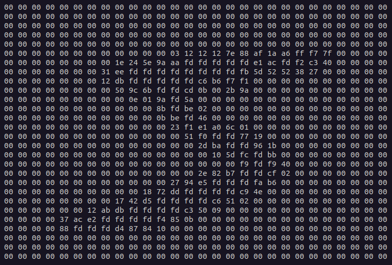
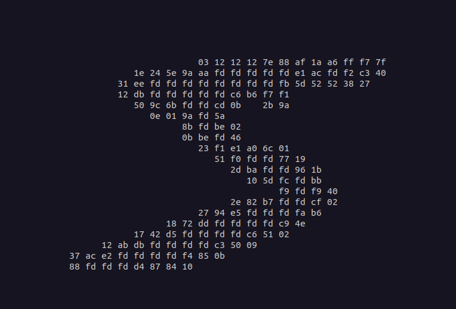

## Multi-Layer Perceptron (MLP) from scratch in C++

### Introduction

Hi everyone, 

What is the <b>"Hello World!"</b> program of neural networks? I think it is definitely a neural network that learns the MNIST dataset [[1]](1).

When I got into machine learning, I just wanted to see how to code an MLP from scratch in C++. It proofed to be quite difficult to find a tutorial that provides that.

Back than, David Millers tutorial [[2]](2) was the only resource for beginners I could find, and has been the inpiration for this MLP. I also follow most of his naming conventions here.

Although I think it is a great tutorial, David makes the neural network learn the XOR function, with only a single output neuron. 
In my opinion this task is a bit too basic to really understand what is going on in neural networks.
I also found the organization of the network partly confusing, as weights and biases are not stored in the actual neurons they are supposed to connect to. 

Taking these considerations into account, I wanted to code an MLP to learn the MNIST dataset.

I will currently not make a full tutorial out of this, but rather discuss some highlights. Feel free to email me (neural-nils (at) gmail.com) if I shall dive deeper into it.

 

> **Disclaimer:**
This code is for educational purposes. In industrial settings you would not create a  Neuron class, but instead use optimized, <b>vectorized</b> implementations. Maybe I can build a vectorized form in the future.

 

##### How does the MNIST data look like?
I think a short look at the byte-level can help a lot.
As outlined on Yann LeCun's website [[1]](1), the training image dataset is a single binary file, that consists of a header with four 32-bit integers:
 - a magic number: 2051
 - number of images: 60000
 - px per row: 28
 - px per columns: 28

The label file consists only of 
 - a magic number: 2049
 - the number of labels: 60000

The 32-bit integers are stored in four bytes in big-endian byte order. E.g. 00 00 08 03 encode the magic number 2051 in big-endian. These bytes need to be flipped from big-endian to little-endian so that we can read them with our machine (IBM provides some good resources on byte shifts [[3]](3)):

~~~cpp
int reverseInt (int i)
{
    unsigned char c1, c2, c3, c4; 
    c1 = i & 255;
    c2 = (i >> 8) & 255; 
    c3 = (i >> 16) & 255; 
    c4 = (i >> 24) & 255;
    return ((int)c1 << 24) + ((int)c2 << 16) + ((int)c3 << 8) + c4; 
}
~~~

If you don't completely get it, don't worry and continue... if you want to know what is going on here, just take a pen and go through the bit shifts yourself. You will end up with a reversed order integer.

Each gray-scale image consists of an unsigned char array that encodes the brightness of each pixel: 60000 pictures for training and 10000 pictures for validation.

Most of the chars are actually 0x00 (which is the black background), therefore, below you can see the number with and without the 0x00 background:

raw bytes                     | without 0x00
:-----------:|:-----------:
 | 

To test the program, simply download the code, and compile it with: 
~~~console
g++ mlp.cpp -o mlp
~~~

Then exectue it with:
~~~console
./mlp
~~~

Initially I was thinking to also provide a command line parser for the topology of the MLP, but as this is an educational project, feel free to just go into the code, change the topology to whatever you like, compile again, and start again. You can also adjust the epochs, meaning how often you want to go through the entire dataset, before running on the testset:
    
Directly below main(), you find:
~~~cpp
std::vector<int>topology{28*28, 250, 10}; 
int epochs = 10; 
~~~

This will create 3 layers with 784 input neurons, 250 hidden neurons, and 10 output neurons. Note, that you can change the middle part as you like, with as much layers and neurons as you want, but you can't change the input and output dimension, because they are fixed for this particular dataset.

As a starting point: a hidden layer of 250 neurons already works decently well. With a hidden layer size of 1000 neurons, I got to an accuracy of >0.90 %.

####The Net
The logic of the MLP in this project is divided between the Net class that organizes the layers, and the Neuron class that handles individual neurons. 
This is obviously very inefficient, as you could implement the entire logic in a vectorized form.
However, it is amazing that it also works like this, and it clarifies the concept very good.

####Feed Forward

The forward propagation is handled by this function. Note, that there is a forward_prop function on the net level, and one on the neuron level. The first layer needs to be set to the input bytes. The forward propagation is then starting from the first hidden layer. The last layer needs to be handled separately again, as the softmax function relies on having the activations of each neurons.

~~~cpp

void forward_prop(const std::vector<double>& input)
    {
        for (int i = 0; i < input.size(); ++i)
        {            
            m_net[0][i].set_activation(input[i]);
        }
        //forward propagation, except the last layer
        for (int layer = 1; layer < m_net.size() -1 ; ++layer) 
        {
            std::vector<Neuron>& prevLayer = m_net[layer - 1];
            for (int neuron = 0; neuron < m_net[layer].size(); ++neuron)
            {
                m_net[layer][neuron].forward_prop(prevLayer);
            }            
        }
        //forward propagation last layer
        std::vector<Neuron>& prevLayer = m_net[m_net.size()-2];
        std::vector<Neuron>& lastLayer = m_net[m_net.size()-1];               
        for (int neuron = 0; neuron < m_net.back().size(); ++neuron)
        {
            lastLayer[neuron].forward_prop_lastlayer(prevLayer);
        } 
    }
~~~
 

#### Activation Functions
 
You might try different activation functions. As a default I set it to the relu function, which is commonly used, but feel free to go into the code and uncomment the sigmoid or tanh. Of course only one function can be active, and you should make sure, that the activation function and its derivative corresponds.

~~~cpp
double activation_function(double z)
{    
    //relu:
    if (z < 0) { return 0; }
    else { return z; }        
}

double activation_function_derivative(double z)
{    
    //relu:
    if (z < 0) { return 0; }
    else { return 1; }
}
~~~

As this is an educational project, the MLP outputs the complete topology with each layer and each neuron in it like this:
~~~console
Layer 2 -> N0,N1,N2,N3,N4,N5,N6,N7,N8,N9,
~~~

  

##### The Softmax Function

Another interesting part is the softmax function applied on the outputs of the last layers:

\[ softmax = \frac{e^{z_i}}{\sum_{j=1}^{K}e^{z_j}} \]

What does it do?
Imagine the 10 output neurons have the following activations after a single run of forward propagation: 
~~~console
[2, 5, 9, 3, 8, 1, 5, 6, 7, 4]
~~~

The softmax function converts this into a probability distribution that sums up to 1.0:
~~~console
[0.001, 0.011, 0.625, 0.002, 0.23, 0, 0.011, 0.031, 0.085, 0.004]
~~~

This is achieved by the following code:

~~~cpp
void get_softmax_y_hat(std::vector<double>& y_hat) 
{
        y_hat.clear();
        std::vector<Neuron> output_layer = m_net.back();
        double sum = 0;         
        for (int neuron = 0; neuron < output_layer.size(); ++neuron)
        {            
            sum += exp(output_layer[neuron].get_activation());
        }        
        for (int neuron = 0; neuron < output_layer.size(); ++neuron)
        {
            double result = exp(output_layer[neuron].get_activation())/sum;
            y_hat.push_back(result);
        }
    }
~~~

#### The Loss

The next function is at the heart of the learning process. It takes y_hat (the prediction) and compares it to y (the truth) and then calculates the loss. As more the output deviates from the correct value, as higher the loss will be. Convergence, or learning of the network can be evaluated by looking whether the loss get's smaller over time.

> *Some Philosophical Thoughts*
The loss is probably the most important value of neural networks and it is also the reason why I am currently a bit sceptical that GPT-4 is indeed exhibiting early forms of sentience (although I don't exclude that possibility), like hypothesized by a Microsoft researcher[[4]](4)... can sentience really be obtained when it's about the reduction of a single number? I don't know the answer, but intuitively I guess some fairy dust is still needed to breath life to neural networks (this might happen sooner than we think, though).

The loss value is a very important diagnostic value, because it means that the neural network converges.

After calculating the loss it is then backpropagated into the layers by utilizing the chain rule of calculus.

~~~cpp
double calculate_gradients(std::vector<double>& y, std::vector<double>& y_hat){    
    if (y.size() != y_hat.size())
    {
        printf("std::vectors don't match...\n");
    } 
    
    std::vector<double> gradients; 
    double loss = 0; 
    for (int i = 0; i < y_hat.size(); ++i)
    {            
        loss += -log(y_hat[i])*y[i];
        double delta = y_hat[i]-y[i];
        m_net.back()[i].set_delta(delta);                        
    }
    loss = loss/y_hat.size();
    
    //hidden_gradients
    for (int layer = m_net.size() - 2; layer > 0; --layer)
    {
        std::vector<Neuron>& hiddenLayer = m_net[layer];
        std::vector<Neuron>& nextLayer = m_net[layer+1];

        for (int n = 0; n < hiddenLayer.size(); ++n)
        {
            double derivative = hiddenLayer[n].activation_function_derivative(hiddenLayer[n].get_z());
            hiddenLayer[n].calculate_hidden_gradients(nextLayer, n, derivative);
        }
    }
    return loss;
}
    
~~~

 

#### Backpropagation

Once the gradients are obtained, we can do the actual backpropagation and update the weights. 

~~~cpp
void backprop(double alpha)
    {        
        for (int layer = 1; layer < m_net.size(); ++layer) 
        {
            for (int n = 0; n < m_net[layer].size(); ++n)
            {
                std::vector<Neuron> prevLayer = m_net[layer - 1];                
                std::vector<double> prev_activations = m_net[layer][n].get_prev_activations(prevLayer);
                                
                for(int w = 0; w < prev_activations.size(); ++w)
                {
                    double dw = prev_activations[w] * m_net[layer][n].get_delta();
                    double new_weight = m_net[layer][n].get_weight(w) - alpha * dw;
                    m_net[layer][n].set_weight(w, new_weight);
                }                                
                double db = m_net[layer][n].get_delta();                
                double new_bias = m_net[layer][n].get_bias() - alpha * db;
                m_net[layer][n].set_bias(new_bias);
            }
        }
    }
~~~

 

#### Summary

The above code snippets highlight some of the concepts in the MLP. 
As soon, as I got over a certain level, I hated incomplete tutorials with low information density and often times the core parts were missing.

I did not go through the entire 500 lines of code, and only discussed some key ideas, but at least, the working code is entirely in this repo, so if you want to figure out how this works, you can print the 500 lines, go through it, and mark it with a pencil. 

Keep in mind: It's really not that difficult, if you print the code on paper and go through it with a pencil, it will proof to be a pretty straightforward idea.

If requested, I could also expand this explanation a bit.

But, I think the amazing part is really, that you can put an MLP on ~500 lines of C++ code. 

The article already got quite lengthy, therefore, I will stop here for now.
If there are any questions or improvements, don't hesitate to ask me.

### References

<a id="1">[1]<a/> http://yann.lecun.com/exdb/mnist/

<a id="2">[2]<a/> https://vimeo.com/19569529

<a id="3">[3]<a/> https://developer.ibm.com/articles/au-endianc/

<a id="4">[4]<a/> "Sparks of AGI: early experiments with GPT-4", https://www.youtube.com/watch?v=qbIk7-JPB2c

